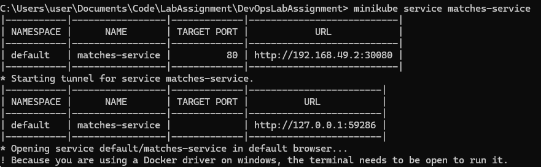
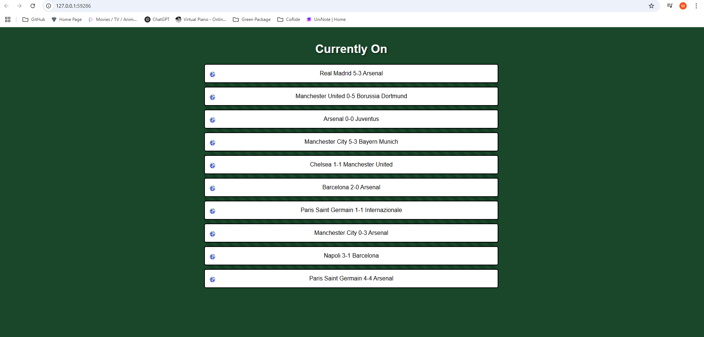

# DevOps Lab Assignment

Repository for the DevOps lab assignment in Software Engineering in Practice course.

## Your tasks for this assignment

Before starting, you'll need to follow the Instructions in the corresponding folder for Docker & Kubernetes Installation and Setup and adjust them to your environment if needed. 

---
This repository contains a very simple application for football match scores using python and flask framework. Before starting, clone this repository locally to have all necessary files and have Docker Desktop open while working on the assignment.

## Docker Task

1. **Create Dockerfile**

   - Ensure that the file is placed in the root folder as it concerns the whole application.
   - Select base image (e.g python:3.12.10).
   - Make sure you add all files of the project while maintaining the same structure as before (be careful in `templates` folder!).
   - Also, make sure that the file includes all necessary information to create the docker image (pip install, cmd, expose).

2. **Build Image**

   - Make sure you give the image a name (add version as well).
   - Run `docker build -t <local-image-name>:<version> .` to build your image locally

3. **Push Image**

   - Push the image to your remote Dockerhub repository (this is necessary for the next task) giving a name you can remember.
   - Run `docker tag <local-image-name>:<version> <username>/<repository>:<remote-image-name>` to tag the image to your remote repository
   - Run `docker push <username>/<repository>:<remote-image-name>` to push your image to your remote repository 

---

## Kubernetes Task

1. **Start your minikube cluster**

   - You should run all minikube and kubectl commands from cmd
   - After that, ensure that everything is correct by running `kubectl get pods -A`

2. **Fill in deployment.yaml file**

   Consider looking at this [example](https://kubernetes.io/docs/concepts/workloads/controllers/deployment/).
   - Specify the deployment name in the metadata field.
   - Specify the name for your app (e.g matches).
   - Select number of replicas (1 should do the trick).
   - Make sure you have the correct image from the Dockerhub repository.

3. **Fill in service.yaml file**

   Consider looking at this [example](https://www.geeksforgeeks.org/kubernetes-nodeport-service/).
   - Specify the name for your app (e.g matches).
   - Specify the service name in the metadata field.
   - Be careful with the ports (make sure you remember them).

4. **Apply your .yaml files**

   - Run `kubectl apply -f <path-to-deployment.yaml>` (e.g .\task1\matches-deployment.yaml)
   - Run `kubectl apply -f <path-to-service.yaml>` (e.g .\task1\matches-services.yaml)

5. **Run your service**

   - Run `minikube service <service-name>`

## Submission Instructions

Create a Github repository and invite us as collaborators (ManolisPapa & DionisiaK4). Consider pushing your local repo for the assignment. The repository should contain:
1. Dockerfile
2. deployment.yaml
3. service.yaml
4. a file (.txt or README.md) with your Dockerhub repository (including name)
5. 2 verification screenshots (as shown below): one showing the output from running your minikube service and one showing that the app is actually working

And that's it! If you have any questions feel free to ask us, you can find us via email at t8220116@aueb.gr (Manolis) and t8220066@aueb.gr (Dionisia).
