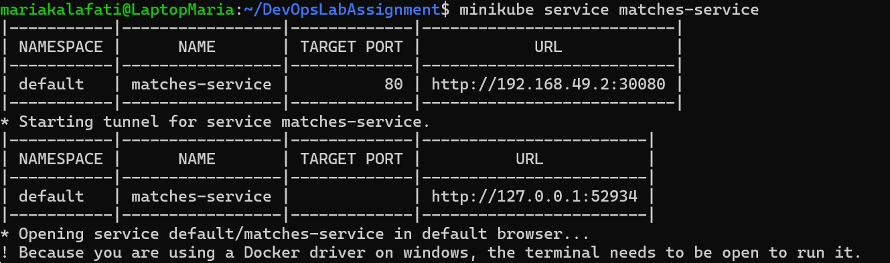
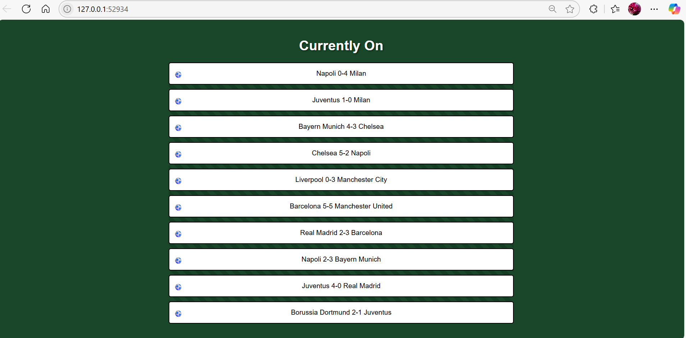

# DevOps Lab Assignment

Repository for the DevOps lab assignment in Software Engineering in Practice course.

## DockerHub

DockerHub repository: mariakalafati/devops (the repository is public) and the image is: image: mariakalafati/devops:1.0

## Repository

This repository includes my local repository for the assignment. Specifically, the repository contains:

Dockerfile
deployment.yaml
service.yaml
README.md with your Dockerhub repository
2 verification screenshots: one showing the output from running your minikube service and one showing that the app is actually working

## Verification Screenshots

Output from running your minikube service 

Screenshot showing that the app is working

